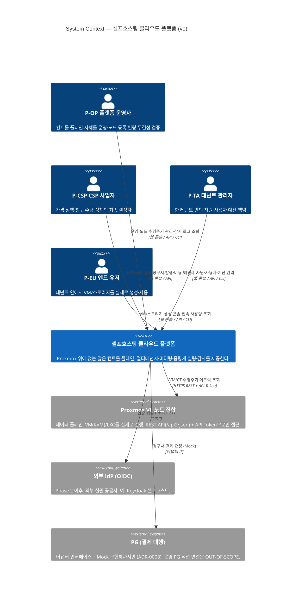

# C4 Level 1 — System Context (v0)

> C4 모델의 최상위 레벨. 본 플랫폼(System of Interest)을 하나의 박스로 보고,
> **누가(페르소나) 사용하는가**와 **무엇(외부 시스템)에 의존하는가**를 그린다.
> 내부 구조는 [Level 2 — Containers](./c4-level2-containers.md)에서 분해한다.
>
> 본 문서는 **Phase 0 Exit 게이트** 산출물 v0다. Phase별로 갱신한다.

## 전제 (입력 문서)

- 페르소나 정의: [`../00-overview/personas.md`](../00-overview/personas.md) (P-OP/P-CSP/P-TA/P-EU)
- 컨트롤 플레인 ↔ 데이터 플레인 분리: [`../00-overview/glossary.md`](../00-overview/glossary.md) §A
- 데이터 플레인 = Proxmox VE: [ADR-0002](../02-adr/0002-use-proxmox-as-hypervisor.md)
- 자체 오케스트레이션 레이어 (Proxmox 자체 클러스터링 미사용): [ADR-0003](../02-adr/0003-not-using-proxmox-clustering.md)
- PG는 어댑터 + Mock까지만: [`../00-overview/scope.md`](../00-overview/scope.md), [ADR-0008](../02-adr/0008-phase3-billing-scope.md)

## 다이어그램

> ⚠ Mermaid의 C4 다이어그램 문법(`C4Context`)은 **experimental**이다. 렌더러(GitHub 등)가 사용하는 Mermaid 버전에 따라 표시가 다를 수 있다. 의미론은 본문 서술로도 완결되게 작성했다.

## 핵심 신뢰 경계 (요약)

상세는 [`./trust-boundaries.md`](./trust-boundaries.md). Level 1 관점에서 가장 바깥 경계만 표시:

1. **사용자 ↔ 플랫폼**: 모든 페르소나 요청은 인증·인가(RBAC)를 통과해야 한다. 모든 통신 TLS ([`../00-overview/vision.md`](../00-overview/vision.md) §3.2 보안 게이트 원칙).
2. **플랫폼 ↔ Proxmox**: 컨트롤 플레인은 Proxmox를 **단일 어댑터 계층**으로만 호출한다. 비즈니스 로직은 Proxmox 엔드포인트를 직접 부르지 않는다 ([ADR-0002](../02-adr/0002-use-proxmox-as-hypervisor.md), [`./c4-level2-containers.md`](./c4-level2-containers.md) Proxmox 어댑터).
3. **플랫폼 ↔ 외부 서비스 (IdP/PG)**: 외부 신뢰 영역. 경계를 넘는 데이터는 검증된다.

## 페르소나 간 권한 비대칭 (위협 모델 입력)

본 컨텍스트에서 4 페르소나는 동등하지 않다. [`../00-overview/personas.md`](../00-overview/personas.md) §7에 따라,
위협 모델은 **P-EU → P-TA → P-CSP → P-OP 방향의 권한 상승(Elevation of Privilege) 시도**를 항상 가정한다.
특히 **P-CSP(가격 정책)와 P-OP(인프라 운영)는 SoD로 분리**되어 1인 운영 환경에서도 동일 자격증명으로 합치지 않는다.

→ 이 비대칭은 [STRIDE 위협 모델 v0](../03-security/threat-model.md)의 신뢰 경계 입력이 된다.

## 범위 밖 (이 다이어그램에 그리지 않는 것)

- 다수 퍼블릭 클라우드: Cloud Bursting은 AWS 1종(Phase 7)으로 한정 (scope.md). v0에는 미표시.
- 데스크탑/모바일 네이티브 클라이언트: OUT-OF-SCOPE (scope.md). 클라이언트는 웹/API/CLI 3종.

## 변경 이력

- v0 (Phase 0): 최초 작성. 4 페르소나 + Proxmox/IdP/PG 외부 시스템.
- v0 (수정): Mermaid C4 experimental 고지 추가. threat-model 링크에 (예정) 표기.
- v0 (수정 2): `threat-model.md` 작성 완료로 (예정) 표기 해제.
- v0 (수정 3): 본 공개 문서의 내부 전용 지침 인용을 공개 근거(vision §3.2, ADR, C4 L2)로 치환 (ADR-0009 준수).
