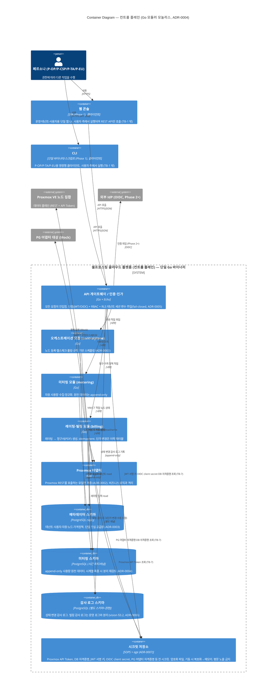

# C4 Level 2 — Containers (v1.3)

> Level 1의 "셀프호스팅 클라우드 플랫폼" 박스를 **배포 가능한 실행 단위(container)** 로 분해한다.
> C4의 "container"는 Docker 컨테이너가 아니라 **독립 실행·배포되는 애플리케이션/데이터 저장소**를 뜻한다.
>
> 본 문서는 **Phase 0 Exit 게이트** 산출물 v0다. Phase별로 갱신한다.

## 전제와 미확정 지점

- 상위 컨텍스트: [Level 1 — System Context](./c4-level1-context.md)
- **백엔드 스택 확정** ([ADR-0004](../02-adr/0004-backend-language-and-framework.md) Accepted): **Go + Echo + sqlc**, **모듈러 모놀리스**(단일 배포, 내부 `controlplane`/`metering`/`billing` 모듈 경계), **PostgreSQL 단일**(메타+미터링 파티셔닝+감사 별 스키마), 작업 큐는 Phase 3 도입. 아래 컨테이너는 이 결정을 반영한다 — 단일 배포 단위 안의 **모듈**이며 물리적 분리는 Phase 4+ 재검토.
- **빌링 무결성 메커니즘 확정** ([ADR-0006](../02-adr/0006-billing-integrity-mechanism.md) Accepted): 미터링 원천은 **append-only**(DB 권한 미부여 + 트리거)에 **해시 체인**, 기간 청구서는 **머클 루트**로 부분 검증. 미터링 스키마는 append-only, 빌링 감사 로그는 별도 스키마+권한으로 분리.
- **시크릿 관리 방식 확정** ([ADR-0007](../02-adr/0007-secret-management.md) Accepted): **SOPS + age**(복호화 라이브러리를 바이너리에 임베드 — 외부 런타임 서비스 없음, age 마스터 키는 git 밖, 실제 암호화 파일은 .gitignore 내부 전용·공개 리포엔 빈 템플릿만). 애플리케이션은 **기동 시 메모리에서 복호화 → 프로세스 메모리에만** 적재하고, 소비자(어댑터·API·빌링)는 provider 인터페이스로 자기 종류 시크릿만 조달(단일 프로세스라 코드 규율, 강한 격리 아님). 로그·에러 redact는 코드 레벨 강제. 외부 시크릿 매니저(Vault 등) 미도입. 시크릿 저장소 박스는 이 결정을 반영한다.
- **멀티테넌시 격리 모델 확정** ([ADR-0005](../02-adr/0005-multitenancy-isolation-model.md) Accepted): 메타데이터는 `tenant_id` + PostgreSQL RLS + 앱 쿼리 필터(sqlc) **이중 방어**, fail-closed. 스토리지는 메타귀속+쿼터. 네트워크 강한 격리는 Phase 5 이연. API 게이트웨이가 RLS 세션 변수를 주입한다.

## 다이어그램

> ⚠ Mermaid의 C4 다이어그램 문법(`C4Container`)은 **experimental**이다. 렌더러(GitHub 등)가 사용하는 Mermaid 버전에 따라 표시가 다르거나 렌더되지 않을 수 있다. 의미론은 본문 표·관계 목록으로도 완결되게 작성했다.

## 컨테이너별 책임 요약

| 컨테이너 | 책임 | 관련 ADR / 규칙 |
|---|---|---|
| 웹 콘솔 / CLI | 페르소나용 클라이언트 (웹/CLI). **컨트롤 플레인 경계 밖**(TB-1)에서 실행, REST API만 호출 | Phase 1 스코프 (ROADMAP) |
| API 게이트웨이 / 인증·인가 | 모든 요청의 단일 진입점. 인증 + RBAC + **테넌트 필터 fail-closed** | vision §3.2, ADR-0005 |
| 오케스트레이션 모듈 (controlplane) | 노드 등록·헬스체크·풀링·스케줄링 | ADR-0003, ADR-0004 |
| 미터링 모듈 (metering) | 사용량 수집·정규화, **append-only** 적재 | vision §3.2, glossary §C, ADR-0004 |
| 레이팅·빌링 모듈 (billing) | 레이팅 → idempotent 청구서. 단가는 이력 테이블 | ADR-0008, ADR-0006 |
| Proxmox 어댑터 | Proxmox REST를 호출하는 **유일한** 계층 | ADR-0002 |
| 메타데이터 스키마 | 테넌트·자원·노드·가격정책 단일 진실 공급원 | ADR-0003, ADR-0004 |
| 미터링 스키마 | append-only 사용량 원천 (시간 파티셔닝) | vision §3.2, glossary §C, ADR-0004 |
| 감사 로그 스키마 | 상태 변경 + 빌링 감사. **빌링 감사는 별도 스키마+권한** | vision §3.2, ADR-0006 |
| 시크릿 저장소 | Proxmox API Token·DB 자격증명·JWT 서명 키·OIDC client secret·PG 자격증명 등 **전 시크릿**(TB-7 소비자: 어댑터·API·빌링). **SOPS + age** 암호화 파일, 기동 시 복호화→메모리. 평문 노출 금지 | vision §3.2, ADR-0007 |

> **저장소 주석**: 메타데이터·미터링·감사 로그 세 스키마는 **단일 PostgreSQL 인스턴스**에 두되 스키마·권한으로 경계를 둔다(ADR-0004). 다이어그램에서 세 박스로 나눈 것은 책임 경계 표현이며 물리적 인스턴스 분리가 아니다. 빌링 감사 로그는 별도 스키마+권한으로 운영 로그와 가른다. 미터링 시계열이 단일 인스턴스 한계를 넘으면 분리를 재검토한다(ADR-0004 회귀 트리거).

## SoD 반영

[`../00-overview/personas.md`](../00-overview/personas.md) §7의 권한 분리는 모듈 경계가 아니라 **API 게이트웨이의 인가 계층**에서 강제된다.
P-CSP의 가격 정책 write 권한과 P-OP의 노드 수명주기 write 권한은 **서로 다른 역할**에 매핑되며, 동일 자격증명으로 합치지 않는다.
구체 RBAC 정의는 Phase 2 (ROADMAP)에서 별도 문서로 확정한다.

## 변경 이력

- v0 (Phase 0): 최초 작성. 스택 중립. 물리적 모놀리식/분할 여부는 ADR-0004 확정 시 갱신 예정.
- v0 (수정): 웹 콘솔/CLI를 컨트롤 플레인 경계 밖 클라이언트로 이동(trust-boundaries TB-1과 일치). TB-7 시크릿 소비자를 어댑터·API·빌링으로 확장(ADR-0007 전 시크릿 범위 반영). Mermaid C4 experimental 고지 추가.
- v0 (수정 2): 본 공개 문서의 내부 전용 지침 인용을 공개 근거(vision §3.2 설계 원칙 + 관련 ADR)로 치환 ([ADR-0009](../02-adr/0009-internal-only-design-docs.md) 내부 전용 정책 준수).
- v1 (ADR-0004 Accepted 반영): 스택 중립 → **Go + Echo + sqlc / 모듈러 모놀리스(단일 바이너리, controlplane·metering·billing 모듈) / PostgreSQL 단일(메타·미터링·감사 스키마 분리)**. 컨테이너 기술 라벨·DB 명칭·단일 인스턴스 주석 반영.
- v1.1 (ADR-0005 Accepted 반영): API 게이트웨이가 RLS 테넌트 세션 변수를 주입(이중 방어·fail-closed), 스토리지 메타귀속+쿼터, 네트워크 강한 격리는 Phase 5 이연. (당시 ADR-0006/0007은 Proposed.)
- v1.2 (ADR-0006 Accepted 반영): 빌링 무결성 미확정 → 해시 체인(미터링)+머클 루트(청구서), append-only 권한+트리거 강제, 빌링 감사 로그 별도 스키마+권한으로 확정 반영. (ADR-0007은 여전히 Proposed.)
- v1.3 (ADR-0007 Accepted 반영): 시크릿 저장소 미확정 → **SOPS + age**(암호화 파일, 기동 시 복호화→메모리, 소비자별 최소 권한 조달, 로그 redact 코드 강제, Vault류 미도입)로 확정. 시크릿 박스 라벨·미확정 지점·책임 요약 갱신. 이로써 Level 2가 참조하는 ADR-0004~0007이 모두 Accepted 반영됨.
