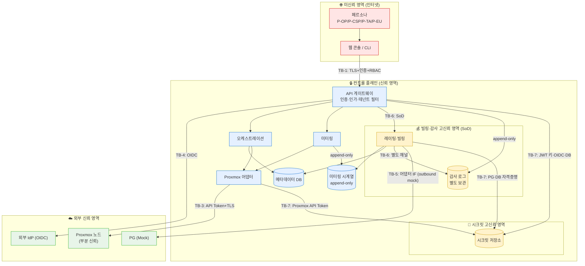

# 신뢰 경계 · 데이터 플로우 (v0)

> 본 문서는 [C4 Level 2](./c4-level2-containers.md)의 컨테이너 사이에 **신뢰 경계(Trust Boundary)** 를 긋고,
> 경계를 넘는 주요 데이터 플로우를 정리한다.
> 이 문서는 [STRIDE 위협 모델 v0](../03-security/threat-model.md)의 **직접 입력**이다 — 위협은 경계를 넘는 지점에서 도출한다.
>
> 신뢰 경계 정의: [`../00-overview/glossary.md`](../00-overview/glossary.md) §D — "신뢰 수준이 다른 두 영역의 경계. 데이터가 이 경계를 넘을 때 검증·인가가 필요."

## 신뢰 경계 목록

| ID | 경계 | 신뢰 수준 차이 | 넘을 때 요구되는 통제 |
|---|---|---|---|
| **TB-1** | 인터넷(페르소나·클라이언트) ↔ 컨트롤 플레인 | 미신뢰 → 신뢰 | TLS, 인증(JWT/OIDC), RBAC, 테넌트 필터, 입력 검증, 레이트 리밋 |
| **TB-2** | 테넌트 A ↔ 테넌트 B (논리적) | 상호 미신뢰 | 모든 자원 쿼리 테넌트 ID 필터 (fail-closed). 우회 경로 발견 시 즉시 위협 모델 반영 (vision §3.2 멀티테넌시 격리, ADR-0005) |
| **TB-3** | 컨트롤 플레인 ↔ Proxmox 데이터 플레인 | 신뢰 → 부분 신뢰 | Proxmox 어댑터 단일 계층 경유 (ADR-0002), API Token, TLS. 노드 침해 가정 |
| **TB-4** | 컨트롤 플레인 ↔ 외부 IdP (OIDC, Phase 2+) | 신뢰 → 외부 신뢰 | OIDC 표준, 토큰 서명 검증, 발급자/Audience 검증 |
| **TB-5** | 컨트롤 플레인 ↔ PG (Mock) | 신뢰 → 외부 | 어댑터 IF. 실 PG 미연동(ADR-0008)이므로 v0에서는 경계만 표시 |
| **TB-6** | 일반 운영 영역 ↔ 빌링/감사 영역 | 신뢰 → 고신뢰(SoD) | 빌링 감사 로그 별도 보관소, 단가 직접 UPDATE 금지, SoD 권한 분리 (vision §3.2 빌링=감사 대상, ADR-0006, personas §7) |
| **TB-7** | 애플리케이션 ↔ 시크릿 저장소 | 신뢰 → 고신뢰 | 시크릿 평문 노출 금지, 로그 redact (vision §3.2 보안 게이트, ADR-0007) |

## 데이터 플로우 다이어그램 (경계 명시)

## 경계별 핵심 위협 시드 (위협 모델 v0 입력)

> 아래는 STRIDE 도출의 출발점일 뿐 완전한 위협 목록이 아니다. 전체는 [위협 모델 v0](../03-security/threat-model.md)에서 다룬다.

| 경계 | 대표 위협 시드 (STRIDE 범주) |
|---|---|
| TB-1 | 자격증명 탈취·세션 위조 (S), 무차별 요청으로 가용성 저하 (D), 입력 검증 우회 (T) |
| TB-2 | 테넌트 필터 우회로 타 테넌트 자원 노출 (I), 권한 상승으로 타 테넌트 조작 (E) |
| TB-3 | API Token 유출 시 노드 직접 조작 (E/T), 노드 침해 시 테넌트 자원 노출 범위 (I) — ADR-0005 Open Q와 연결 |
| TB-4 | IdP 토큰 위조·재생 (S), 발급자 검증 누락 (S) |
| TB-5 | **v0 범위: outbound mock-only.** 현 다이어그램에 inbound 결제 콜백 경로가 없어 콜백 재생류 위협은 현 범위에 없음. 다만 어댑터 IF 자격증명 유출(I)은 TB-7과 함께 평가. **실 PG 연동 시 재평가**: 결제 상태 위조(S/T), 콜백 재생(R), 요청 변조(T) — ADR-0008로 현재는 미연동 |
| TB-6 | 단가 무단 변경·미터링 원천 변조 (T), 변경 부인 (R), SoD 우회로 자기 승인 (E) |
| TB-7 | 시크릿 로그 유출 (I), 평문 저장 (I). **소비자 다수**: Proxmox API Token(어댑터), JWT 서명 키·OIDC client secret·DB 자격증명(API), PG 어댑터 자격증명(빌링) — 어느 한 소비자의 redact 누락도 전 시크릿 노출로 번질 수 있음 (E로 확대 가능) |

## 변경 이력

- v0 (Phase 0): 최초 작성. TB-1~TB-7 정의, 데이터 플로우, STRIDE 위협 시드. 위협 모델 v0의 입력.
- v0 (수정): 위협 시드 표에 TB-5(outbound mock-only 명시) 행 추가. TB-7 시드를 다수 소비자(어댑터·API·빌링) 관점으로 확장. C4 Level 2와 클라이언트 위치 일치 확인(클라이언트는 컨트롤 플레인 밖).
- v0 (수정 2): 데이터 플로우 그림의 TB-7 관계를 표·C4 Level 2와 일치시킴 — `api → secrets`, `billing → secrets` 추가(기존 `adapter → secrets`만 있던 축소 표현 정정). TB-5 화살표 라벨에 outbound mock 명시.
- v0 (수정 3): `threat-model.md` 작성 완료로 forward link의 (예정) 표기 해제.
- v0 (수정 4): 본 공개 문서의 내부 전용 지침 인용을 공개 근거(vision §3.2, ADR, personas)로 치환 (ADR-0009 준수).
